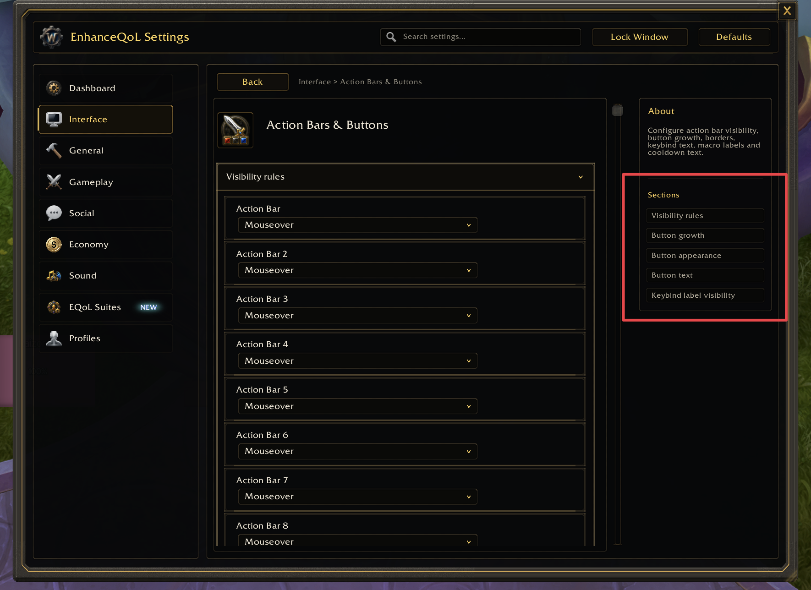

<a name="Top"></a>
<details open>
<summary><strong>Contents</strong></summary><br />

- [Overview](#overview)
- [Getting the API](#getting-the-api)
- [Methods](#methods)
- [Open](#open)
- [Toggle](#toggle)
- [GetFrame](#getframe)
- [ResolveOpenTarget](#resolveopentarget)
- [Frame State](#frame-state)
- [Size, Lock, and Density Persistence](#size-lock-and-density-persistence)
- [Topbar Configuration](#topbar-configuration)
- [Category Page Tabs](#category-page-tabs)
- [Side Panel Subnavigation](#side-panel-subnavigation)
- [Refresh Rules](#refresh-rules)
- [Examples](#examples)

</details>

## [Overview][Top]

The UI API renders the settings center for an app registered through the Config
API. It owns the visible frame, navigation, dashboard, sidebar, search, page
layout, control widgets, notes, density controls, reload-pending state display
hooks, topbar actions, category page tabs, side-panel subnavigation, and
open/toggle helpers.

It should render metadata. It should not contain host-addon-specific feature
logic.

## [Getting the API][Top]

```lua
local addonName, addon = ...
local ConfigUI = addon.LibSettingsDesigner and addon.LibSettingsDesigner.UI
```

The UI API expects `addon.LibSettingsDesigner.Config` to be loaded first.

## [Methods][Top]

| Method | Description |
| :----- | :---------- |
| `Open(appOrID, pageID, focusControlID)` | Opens the settings frame. Optionally navigates to a page and focuses a control. |
| `Toggle(appOrID, pageID, focusControlID)` | Opens the frame if hidden, or hides it if already open. |
| `GetFrame(appOrID)` | Returns the existing settings frame for the app, when available. |
| `ResolveOpenTarget(app, pageID, focusControlID)` | Resolves page/control focus shortcuts. |

## [Open][Top]

```lua
ConfigUI:Open(app)
ConfigUI:Open(app, "interface.action-bars")
ConfigUI:Open(app, "interface.action-bars", "barScale")
ConfigUI:Open(app, "icons") -- opens the category, or its resolved tab page
```

`appOrID` can be the app object or the registered addon id:

```lua
ConfigUI:Open("MyAddon", "general.core")
```

Use stable category/page/control ids. Do not use localized labels. A category id
opens that category; when the category has `tabView` enabled, it resolves to the
remembered, default, or first visible tab page.

Good:

```lua
ConfigUI:Open(app, "interface.action-bars", "barScale")
```

Bad:

```lua
ConfigUI:Open(app, "Action Bars", "Scale")
```

## [Toggle][Top]

```lua
ConfigUI:Toggle(app)
ConfigUI:Toggle(app, "general.core")
```

Use `Toggle` for slash commands or minimap buttons that should close the window
when it is already open.

Use `Open` when the user explicitly clicked a navigation target and you always
want the requested page shown.

## [GetFrame][Top]

```lua
local frame = ConfigUI:GetFrame(app)
```

Use this when a host addon needs to check whether the settings center already
exists or is currently shown.

Example:

```lua
local frame = ConfigUI:GetFrame(app)
if frame and frame:IsShown() then
  -- Settings window is already open.
end
```

## [ResolveOpenTarget][Top]

`ResolveOpenTarget(app, pageID, focusControlID)` resolves page/control shortcuts
used by `Open`.

A direct page and control id is clearest:

```lua
ConfigUI:Open(app, "interface.action-bars", "barScale")
```

If a combined target is used, the resolver can split the longest matching page
id and use the remaining part as the control id. Keep ids unambiguous.

## [Frame State][Top]

The rendered frame stores internal state at:

```lua
frame._LibSettingsDesignerState
```

Use this only for narrow integration points, such as refreshing the currently
rendered page after external runtime data changed:

```lua
local frame = addon.ConfigCenterFrame
local state = frame and frame._LibSettingsDesignerState
if frame and frame:IsShown() and state and state.RenderContent then
  state:RenderContent()
end
```

Do not use frame state as a replacement for proper setters, wrapper callbacks,
or control registration.

## [Size, Lock, and Density Persistence][Top]

The app can provide persistence callbacks:

```lua
local app = Config:RegisterAddOn(addonName, {
  getSize = function()
    local db = MyAddonDB.profile.settingsWindow or {}
    return db.width, db.height
  end,
  setSize = function(width, height)
    MyAddonDB.profile.settingsWindow = MyAddonDB.profile.settingsWindow or {}
    MyAddonDB.profile.settingsWindow.width = width
    MyAddonDB.profile.settingsWindow.height = height
  end,
  getLocked = function()
    return MyAddonDB.profile.settingsWindow
      and MyAddonDB.profile.settingsWindow.locked == true
  end,
  setLocked = function(locked)
    MyAddonDB.profile.settingsWindow = MyAddonDB.profile.settingsWindow or {}
    MyAddonDB.profile.settingsWindow.locked = locked == true
  end,
  getDensity = function()
    return MyAddonDB.profile.settingsWindow
      and MyAddonDB.profile.settingsWindow.density
  end,
  setDensity = function(value)
    MyAddonDB.profile.settingsWindow = MyAddonDB.profile.settingsWindow or {}
    MyAddonDB.profile.settingsWindow.density = value == "compact" and "compact" or "comfortable"
  end,
})
```

Use these callbacks instead of hard-coding frame size, lock, or density state
inside the library. `density` sets the initial layout; `getDensity` and
`setDensity` persist the user's compact/comfortable choice. Set
`showDensityButton = false` when the density switch should not be shown.

## [Topbar Configuration][Top]

The app can configure built-in topbar parts and add action buttons without
manual frame positioning:

```lua
local app = Config:RegisterAddOn(addonName, {
  topbar = {
    showSearch = true,
    showDensity = true,
    showLock = true,
    showDefaults = true,

    titleActions = {
      {
        id = "reload",
        label = RELOADUI or "Reload UI",
        visible = function(app) return app:IsReloadPending() end,
        tooltip = function(app) return app:GetReloadPendingReason() end,
        pulse = true,
        onClick = function() ReloadUI() end,
      },
    },

    actions = {
      {
        id = "tools",
        icon = "Interface\\Icons\\INV_Misc_Gear_01",
        iconOnly = true,
        tooltip = "Tools",
        menu = {
          { text = "Open profile folder", onClick = function() MyAddon.ShowProfilePath() end },
          { text = "Reset cache", onClick = function() MyAddon.ResetCache() end },
        },
      },
    },
  },
})
```

`titleActions` render after the title from left to right. `actions` /
`rightActions` render automatically to the left of the built-in search, lock,
density, and defaults controls. The library owns spacing, button chrome, hover
state, pulse state, and context-menu creation.

Action fields:

| Field | Purpose |
| :---- | :------ |
| `id` | Stable action id. |
| `label` / `text` / `title` | Button text. May be a function. |
| `icon` / `iconKey` | Optional icon texture or app icon-key lookup. |
| `iconOnly` | `true` makes a compact icon button. |
| `visible` / `visibleWhen` / `isVisible` | Show gate. May be a function. |
| `enabled` / `enabledWhen` / `isEnabled` | Enabled gate. May be a function. |
| `tooltip` / `description` | Tooltip text. May be a function. |
| `pulse` | `true` applies a subtle alpha pulse. |
| `onClick(app, action, state, button)` | Click callback for normal actions. |
| `menu` / `menuItems` / `entries` | Static context-menu entries. |
| `buildMenu` / `setupMenu` | Callback for custom `MenuUtil.CreateContextMenu` setup. |

Menu entries support `text`/`label`, `onClick`, `checked`/`isSelected`,
`setSelected`, nested `children`/`entries`, `visible`/`isVisible`, and
`divider = true`.

Reload prompts remain host-owned. A host addon can mark reload-pending via
`requiresReload = true` on controls or `app:MarkReloadPending(reason)`, then
show that state through a topbar action as above.

```lua
app:RegisterControl("interface.names", {
  id = "nameplateFont",
  key = "nameplateFont",
  type = "dropdown",
  label = "Nameplate font",
  default = "default",
  list = fontOptions,
  orderList = fontOrder,
  requiresReload = true,
  reloadReason = "Nameplate font changes apply after reloading the UI.",
})
```

## [Category Page Tabs][Top]

Category page tabs turn a sidebar category into a tabbed page group. When the
user clicks the category in the left sidebar, the UI opens a resolved page from
that category and renders sibling pages as horizontal tabs above the detail
content.

```lua
local app = Config:RegisterAddOn(addonName, {
  getSelectedCategoryPage = function(categoryID)
    return MyAddonDB.profile.settingsTabs
      and MyAddonDB.profile.settingsTabs[categoryID]
  end,
  setSelectedCategoryPage = function(categoryID, pageID)
    MyAddonDB.profile.settingsTabs = MyAddonDB.profile.settingsTabs or {}
    MyAddonDB.profile.settingsTabs[categoryID] = pageID
  end,
})

app:RegisterCategory({
  id = "icons",
  title = "Icons",
  tabView = {
    enabled = true,
    defaultPageID = "icons.catalog",
    remember = true,
  },
})
```

Resolution order when the category is opened:

1. remembered visible page when `remember = true`
2. `defaultPageID`, `defaultPage`, or `pageID`
3. first visible page in category order

Tab clicks call `state:SetPage(page.id)`. The left sidebar continues to mark the
owning category as selected, while the horizontal tab strip marks the active
page. Pages can set `tabTitle` for a shorter label or `tabHidden = true` /
`hideTab = true` to stay out of the tab strip.

## [Side Panel Subnavigation][Top]

On detail pages with a right side panel, the library can render optional links
to page groups. The default is off: existing pages do not show a `Sections`
block unless the host addon enables it. When enabled for a normal settings page
with more than one visible group, the right panel shows a `Sections` block below
the page about text. Clicking a section opens the same page, expands that group
if needed, and scrolls to the first control in the group.



Enable it globally on app options or for one page:

```lua
local app = Config:RegisterAddOn(addonName, {
  subnav = {
    enabled = true,
  },
})

app:RegisterPage({
  id = "interface.minimap",
  category = "interface",
  title = "Minimap",
  showSubnav = true,
})
```

Then register page groups and assign controls with `groupID`. Each visible group
becomes one button in the side-panel `Sections` block:

```lua
app:RegisterCategory({
  id = "interface",
  title = "Interface",
  order = 100,
})

app:RegisterPage({
  id = "interface.action-bars",
  category = "interface",
  title = "Action Bars & Buttons",
  description = "Configure action bar visibility and button labels.",
  showSubnav = true,
  order = 100,
})

app:RegisterGroup("interface.action-bars", {
  id = "visibility",
  title = "Visibility rules",
  order = 100,
})

app:RegisterGroup("interface.action-bars", {
  id = "growth",
  title = "Button growth",
  order = 200,
})

app:RegisterGroup("interface.action-bars", {
  id = "text",
  title = "Button text",
  order = 300,
})

app:RegisterControl("interface.action-bars", {
  id = "bar1Visibility",
  key = "bar1Visibility",
  type = "dropdown",
  label = "Action Bar",
  groupID = "visibility",
  default = "mouseover",
  list = {
    always = "Always",
    mouseover = "Mouseover",
    never = "Never",
  },
  orderList = { "always", "mouseover", "never" },
})

app:RegisterControl("interface.action-bars", {
  id = "buttonGrowth",
  key = "buttonGrowth",
  type = "dropdown",
  label = "Growth direction",
  groupID = "growth",
  default = "right",
  list = {
    left = "Left",
    right = "Right",
    up = "Up",
    down = "Down",
  },
  orderList = { "left", "right", "up", "down" },
})

app:RegisterControl("interface.action-bars", {
  id = "macroText",
  key = "macroText",
  type = "toggle",
  label = "Macro text",
  groupID = "text",
  default = true,
})
```

Use `showSubnav = true`, `showSubnavigation = true`, or
`subnav = { enabled = true }` to show it for a page. Function values are called
with the app/page context and must return `true` to show the block.

## [Refresh Rules][Top]

Use a current-page refresh when external state changes the options or visibility
of already-rendered rows:

```lua
local frame = addon.ConfigCenterFrame
local state = frame and frame._LibSettingsDesignerState
if frame and frame:IsShown() and state and state.RenderContent then
  state:RenderContent()
end
```

Good use cases:

- a standalone editor changed data used by visible rows
- available dropdown options changed outside the dropdown interaction
- a page-level visibility gate changed outside a settings callback

Avoid this:

- inside a MultiDropdown option click
- while a dropdown menu is open
- as a substitute for a focused row update or runtime feature refresh

## [Examples][Top]

Open from a slash command:

```lua
SLASH_MYADDON1 = "/myaddon"
SlashCmdList.MYADDON = function(input)
  input = strtrim(input or "")
  if input == "bars" then
    ConfigUI:Open(app, "interface.action-bars")
  else
    ConfigUI:Toggle(app)
  end
end
```

Open a specific control from a warning prompt:

```lua
MyAddon.ShowFixButton = function()
  ConfigUI:Open(app, "general.core", "enabled")
end
```

Refresh after external data import:

```lua
MyAddon.ImportProfile = function(imported)
  MyAddonDB.profile = imported

  local frame = addon.ConfigCenterFrame
  local state = frame and frame._LibSettingsDesignerState
  if frame and frame:IsShown() and state and state.RenderContent then
    state:RenderContent()
  end
end
```

[//]: # (Links)
[Top]: #Top
