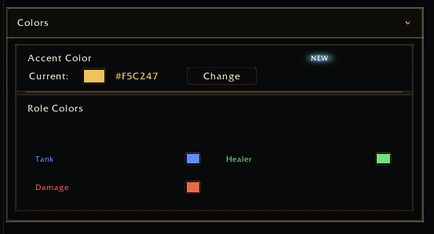

<a name="Top"></a>
<details open><summary><strong>Contents</strong></summary><br />

- [Overview](#overview)
- [Preview](#preview)
- [Fields](#fields)
- [Example](#example)
- [Legacy Alias](#legacy-alias)

</details>

## [Overview][Top]

ColorPalette manages multiple keyed color values in one row. Use it for role
colors, class colors, border colors, status colors, or other small named color
sets owned by the host addon.

Use `type = "colorpalette"` for new code.

## [Preview][Top]



## [Fields][Top]

| Field | Type | Description |
| :---- | :--- | :---------- |
| `entries` | table/function | List of `{ key, label }` color entries, or `function(app, control) return entries end`. |
| `getColor` | function | Reads current color by key. |
| `setColor` | function | Writes color by key. |
| `hasOpacity` | boolean | Show alpha channel. |
| `colorizeLabel` | boolean | Tint entry labels with current colors. |
| `hasOverride` | function | Optional override-state callback: `function(key, entry, app, control)`. |
| `clearColor` | function | Optional reset/inherit callback. Shows a reset button per overridden swatch. |
| `getInheritedColor` | function | Optional inherited color fallback when no explicit color exists. |
| `getDefaultColor` | function | Optional default color fallback when no explicit or inherited color exists. |

When `entries` is a function, the renderer resolves it on render and visible-row
refresh. If the number of entries changes during refresh, the current page is
re-rendered.

## [Example][Top]

```lua
app:RegisterControl("bars.colors", {
  id = "classColors",
  type = "colorpalette",
  label = "Class colors",
  entries = {
    { key = "WARRIOR", label = "Warrior" },
    { key = "MAGE", label = "Mage" },
  },
  getColor = function(key)
    return MyAddonDB.profile.classColors[key]
  end,
  setColor = function(key, r, g, b, a)
    MyAddonDB.profile.classColors[key] = { r = r, g = g, b = b, a = a or 1 }
    MyAddon.RefreshClassColors()
  end,
})
```

## [Dynamic Entries and Inheritance][Top]

Use dynamic entries when the list depends on runtime data such as user-created
groups:

```lua
app:RegisterControl("groups.colors", {
  id = "groupColors",
  type = "colorpalette",
  label = "Group colors",
  entries = function(app, control)
    return MyAddon.BuildCurrentGroupColorEntries()
  end,
  getColor = function(key)
    return MyAddonDB.profile.groupColorOverrides[key]
  end,
  setColor = function(key, r, g, b, a)
    MyAddonDB.profile.groupColorOverrides[key] = { r = r, g = g, b = b, a = a or 1 }
  end,
  hasOverride = function(key)
    return MyAddonDB.profile.groupColorOverrides[key] ~= nil
  end,
  clearColor = function(key)
    MyAddonDB.profile.groupColorOverrides[key] = nil
  end,
  getInheritedColor = function(key)
    return MyAddon.GetGroupBaseColor(key)
  end,
})
```

Do not use a real color value such as white to mean reset. Keep reset/inherit
state explicit with `clearColor` and `hasOverride`.

## [Legacy Alias][Top]

`type = "coloroverrides"` and `type = "coloroverride"` are legacy aliases for
`type = "colorpalette"`. They still render the same widget for older host
addons, but new code and documentation should use `colorpalette`.

[//]: # (Links)
[Top]: #Top
