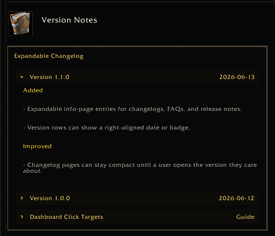

<a name="Top"></a>
<details open><summary><strong>Contents</strong></summary><br />

- [Overview](#overview)
- [Preview](#preview)
- [Fields](#fields)
- [Changelog Example](#changelog-example)
- [Behavior](#behavior)

</details>

## [Overview][Top]

Expandable entries render collapsible text sections inside info pages. Use them
for changelogs, release notes, FAQs, or dense help pages where users should scan
headings first and open details only when needed.

Expandable entries are info-page entries, not settings controls. They do not
store SavedVariables and do not count as customized settings.

## [Preview][Top]



## [Fields][Top]

| Field | Type | Meaning |
| :---- | :--- | :------ |
| `type` | string | Use `"expandable"`. `"collapsible"` and `"collapse"` are aliases. |
| `id` / `key` | string | Stable expansion-state key. Recommended. |
| `title` / `label` | string | Header text. |
| `rightText` / `date` | string | Optional right-aligned header text. |
| `text` / `body` / `desc` | string | Optional body text shown when expanded. |
| `entries` / `blocks` | table | Nested info-page entries shown when expanded. |
| `defaultExpanded` / `expanded` | boolean | Start expanded when no session state exists. |
| `collapsed` | boolean | Start collapsed when true. |
| `headerHeight` | number | Optional header height. Defaults to `34`. |

Nested entries can use the normal info-page entry types: `text`, `command`,
`button`, `image`, `spacer`, and additional `expandable` entries.

## [Changelog Example][Top]

```lua
app:RegisterPage({
  id = "help.changelog",
  category = "help",
  title = "Changelog",
  layout = "info",
  content = {
    {
      title = "Release Notes",
      entries = {
        {
          type = "expandable",
          id = "version-2.6.1",
          title = "Version 2.6.1",
          rightText = "2026-05-31",
          defaultExpanded = true,
          entries = {
            { type = "text", text = "|cffffd100Added|r" },
            { type = "text", text = "- Added a new guild tab." },
            { type = "text", text = "- Added theme customization." },
            { type = "text", text = "|cffffd100Fixed|r" },
            { type = "text", text = "- Fixed edge cases in cached raid roster names." },
          },
        },
        {
          type = "expandable",
          id = "version-2.6.0",
          title = "Version 2.6.0",
          rightText = "2026-05-25",
          entries = {
            { type = "text", text = "- Earlier release notes stay collapsed until opened." },
          },
        },
      },
    },
  },
})
```

## [Behavior][Top]

Expansion state is kept in the currently open settings frame state. It is not
persisted to SavedVariables by the library.

Use stable `id` or `key` values. If omitted, the runtime falls back to the
entry title or generated path, which can change when text or ordering changes.

[//]: # (Links)
[Top]: #Top
