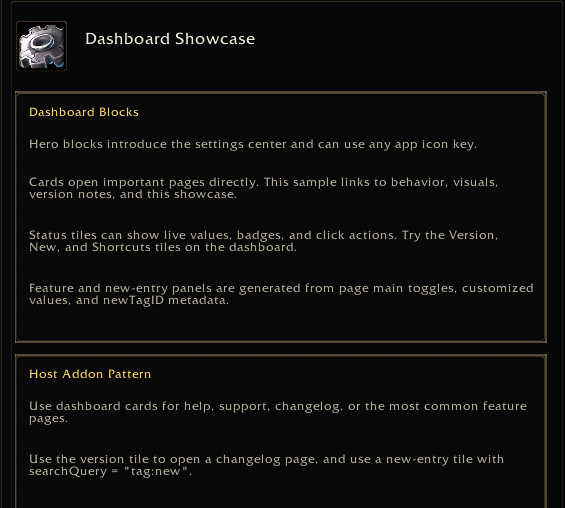

<a name="Top"></a>
<details open><summary><strong>Contents</strong></summary><br />

- [Overview](#overview)
- [Preview](#preview)
- [Content Blocks](#content-blocks)
- [Entry Types](#entry-types)
- [Expandable Entries](#expandable-entries)
- [Example](#example)

</details>

## [Overview][Top]

Info pages render static/help content instead of settings controls. Use
`layout = "info"`.

## [Preview][Top]



## [Content Blocks][Top]

```lua
{
  title = "Section title",
  entries = {
    -- entries
  },
}
```

## [Entry Types][Top]

| Type | Fields | Description |
| :--- | :----- | :---------- |
| `text` | `text` | Paragraph or bullet text. |
| `command` | `commands`, `usage`, `desc`, `note` | Slash command display. |
| `button` | `text`, `width`, `height`, `onClick`, `inline` | Action button. |
| `expandable` | `id`, `title`, `rightText`, `entries` | Collapsible text/details section. |
| `image` | `image` / `texture`, `width`, `height` | Static image. |
| `spacer` | `height` | Vertical spacing. |

Set `buttonLayout = "wrap"` on a content block to render consecutive buttons
horizontally and wrap them onto the next row when they no longer fit. Optional
block fields are `buttonWidth`, `buttonHeight`, `buttonGap`, and
`buttonRowGap`. A single button can opt in with `inline = true`.

## [Expandable Entries][Top]

Use `type = "expandable"` for changelogs, FAQs, and dense help sections.

```lua
{
  type = "expandable",
  id = "version-1.1.0",
  title = "Version 1.1.0",
  rightText = "2026-06-13",
  defaultExpanded = true,
  entries = {
    { type = "text", text = "|cffffd100Added|r" },
    { type = "text", text = "- Expandable changelog sections." },
  },
}
```

See [Expandable](Expandable.md) for the full field list.

## [Example][Top]

```lua
app:RegisterPage({
  id = "help.quick-reference",
  category = "help",
  title = "Quick Reference",
  layout = "info",
  content = {
    {
      title = "Slash Commands",
      buttonLayout = "wrap",
      buttonWidth = 180,
      entries = {
        { type = "text", text = "Use these commands in chat." },
        { type = "command", commands = { "/myaddon" }, desc = "Open settings." },
        { type = "spacer", height = 8 },
        {
          type = "button",
          text = "Copy URL",
          width = 180,
          onClick = function()
            MyAddon.ShowCopyURLPopup()
          end,
        },
        {
          type = "button",
          text = "Open Discord",
          onClick = function()
            MyAddon.OpenDiscord()
          end,
        },
      },
    },
  },
})
```

[//]: # (Links)
[Top]: #Top
