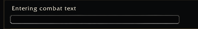

<a name="Top"></a>
<details open><summary><strong>Contents</strong></summary><br />

- [Overview](#overview)
- [Preview](#preview)
- [Fields](#fields)
- [Text](#text)
- [Numeric](#numeric)
- [Multiline](#multiline)

</details>

## [Overview][Top]

Input controls store text or numbers.

## [Preview][Top]



## [Fields][Top]

| Field | Type | Description |
| :---- | :--- | :---------- |
| `placeholder` / `placeholderText` | string | Empty input hint. |
| `numeric` | boolean | Parse as number. |
| `min`, `max` | number | Numeric bounds. |
| `clampToRange` | boolean | Clamp numeric input. |
| `maxChars` | number | Text length cap. |
| `readOnly` | boolean | Prevent editing. |
| `inputWidth` | number | Input width. |
| `multiline` | boolean | Use multiline edit box. |

`multilineHeight` is currently metadata/pass-through only and is not consumed by
the UI renderer. The current multiline editor height is fixed by the runtime.

## [Text][Top]

```lua
app:RegisterControl("profiles.names", {
  id = "profileName",
  key = "profileName",
  type = "input",
  label = "Profile name",
  placeholder = "Name",
  maxChars = 32,
  default = "",
})
```

## [Numeric][Top]

```lua
app:RegisterControl("timers.pull", {
  id = "pullSeconds",
  key = "pullSeconds",
  type = "input",
  label = "Pull timer",
  numeric = true,
  min = 3,
  max = 60,
  clampToRange = true,
  default = 10,
})
```

## [Multiline][Top]

```lua
app:RegisterControl("macros.body", {
  id = "macroBody",
  key = "macroBody",
  type = "input",
  label = "Macro body",
  multiline = true,
  inputWidth = 420,
  default = "",
})
```

[//]: # (Links)
[Top]: #Top
