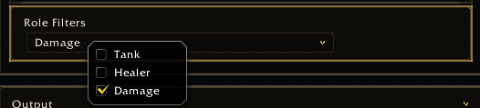

<a name="Top"></a>
<details open><summary><strong>Contents</strong></summary><br />

- [Overview](#overview)
- [Preview](#preview)
- [Fields](#fields)
- [Selection Map](#selection-map)
- [Per Option Callbacks](#per-option-callbacks)
- [Rules](#rules)

</details>

## [Overview][Top]

A MultiDropdown stores multiple selected values. The expected storage shape is a
boolean map where selected keys are `true`.

## [Preview][Top]



## [Fields][Top]

| Field | Type | Description |
| :---- | :--- | :---------- |
| `options` / `list` | table | Value-to-label map. |
| `orderList` / `order` | table | Display order. |
| `getSelection` | function | Returns a boolean map. |
| `setSelection` | function | Writes a boolean map. |
| `isSelectedFunc` | function | Per-option selected reader. |
| `setSelectedFunc` | function | Per-option selected writer. |
| `menuHeight` | number | Menu height. |

`hideSummary` is currently metadata/pass-through only and is not consumed by the
UI renderer.

## [Selection Map][Top]

```lua
app:RegisterControl("group.roles", {
  id = "roles",
  type = "multidropdown",
  label = "Roles",
  options = { tank = "Tank", healer = "Healer", damage = "Damage" },
  orderList = { "tank", "healer", "damage" },
  getSelection = function()
    return MyAddonDB.profile.roles or {}
  end,
  setSelection = function(selection)
    MyAddonDB.profile.roles = selection or {}
    MyAddon.RefreshRoles()
  end,
  default = {},
})
```

## [Per Option Callbacks][Top]

```lua
isSelectedFunc = function(value)
  local roles = MyAddonDB.profile.roles
  return roles and roles[value] == true
end

setSelectedFunc = function(value, selected)
  MyAddonDB.profile.roles = MyAddonDB.profile.roles or {}
  MyAddonDB.profile.roles[value] = selected and true or nil
  MyAddon.RefreshRoles()
end
```

## [Rules][Top]

- Do not rebuild the settings frame from `setSelectedFunc`.
- Deselect by removing keys or assigning `nil`.
- Use `menuHeight` for large option sets.

[//]: # (Links)
[Top]: #Top
