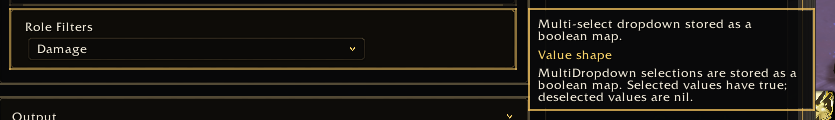
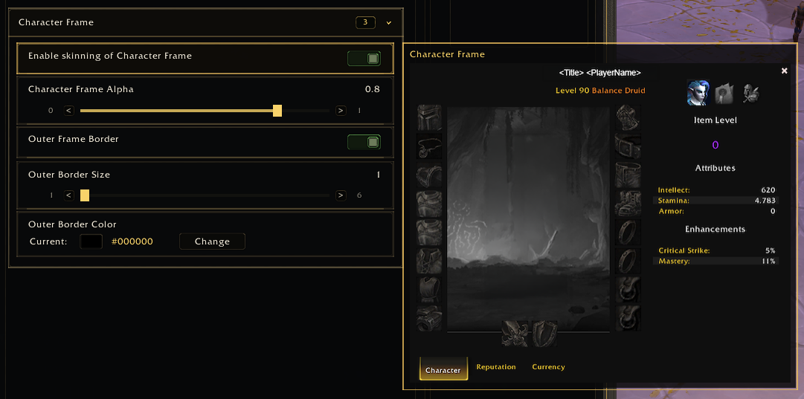

<a name="Top"></a>
<details open><summary><strong>Contents</strong></summary><br />

- [Overview](#overview)
- [Preview](#preview)
- [Fields](#fields)
- [Simple Note](#simple-note)
- [Rich Note](#rich-note)
- [Spacing Rule](#spacing-rule)

</details>

## [Overview][Top]

Notes provide hover help for controls and additional page documentation.

Supported control fields:

- `note`
- `notes`
- `richNote`
- `richNotes`

## [Preview][Top]





## [Fields][Top]

| Field | Type | Description |
| :---- | :--- | :---------- |
| `title` | string | Optional heading. |
| `text` | string | Body text. |
| `blocks` | table | Ordered rich blocks. |
| `order` | number | Sort order. |
| `visible` / `condition` | function | Conditional display. |
| `color` | table | Text color. |
| `font` | string | Font object/template. |

## [Simple Note][Top]

```lua
note = {
  title = "Details",
  text = "Configure layout, display, bars, fonts, colors, and behavior in Edit Mode.",
}
```

## [Rich Note][Top]

```lua
notes = {
  {
    title = "Preview",
    blocks = {
      { text = "Use preview mode before entering combat." },
      { type = "spacer", height = 8 },
      {
        image = "Interface\\AddOns\\MyAddon\\Media\\preview.tga",
        width = 256,
        height = 144,
      },
    },
  },
}
```

## [Spacing Rule][Top]

The note panel measures rendered font height and removes the trailing row gap
from the final panel height. This keeps top and bottom padding visually even.

[//]: # (Links)
[Top]: #Top
