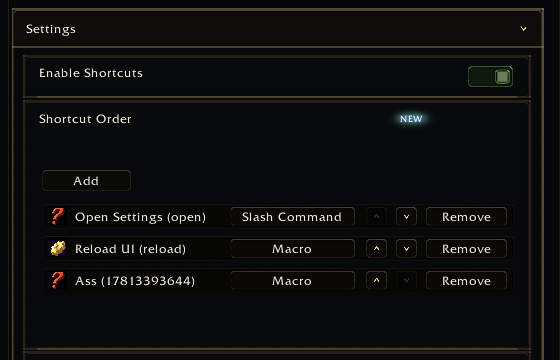

<a name="Top"></a>
<details open><summary><strong>Contents</strong></summary><br />

- [Overview](#overview)
- [Preview](#preview)
- [Fields](#fields)
- [Entry Shape](#entry-shape)
- [Example](#example)

</details>

## [Overview][Top]

ReorderList renders an ordered list with move/remove/format controls. The
consumer owns the backing table and callbacks.

## [Preview][Top]



## [Fields][Top]

| Field | Type | Description |
| :---- | :--- | :---------- |
| `getEntries` | function | Returns ordered entries. |
| `moveEntry` | function | Moves one entry. |
| `removeEntry` | function | Removes one entry. |
| `setEntryFormat` | function | Sets an entry format key. |
| `formatOptions` | table | Format key-to-label map. |
| `formatOrder` | table | Format display order. |
| `rowHeight` | number | Custom row height. |
| `emptyText` | string | Empty-list message. |

## [Entry Shape][Top]

Entries can use fields such as:

```lua
{
  id = "health",
  label = "Health",
  icon = "Interface\\Icons\\INV_Potion_54",
  format = "icon",
}
```

## [Example][Top]

```lua
app:RegisterControl("bars.layout", {
  id = "barOrder",
  type = "reorderlist",
  label = "Bar order",
  rowHeight = 260,
  getEntries = function()
    return MyAddonDB.profile.barOrder or {}
  end,
  moveEntry = function(fromIndex, toIndex)
    MyAddon.MoveBarOrderEntry(fromIndex, toIndex)
  end,
  removeEntry = function(index)
    MyAddon.RemoveBarOrderEntry(index)
  end,
  setEntryFormat = function(index, formatKey)
    MyAddon.SetBarOrderFormat(index, formatKey)
  end,
  formatOptions = { icon = "Icon", text = "Text" },
  formatOrder = { "icon", "text" },
})
```

[//]: # (Links)
[Top]: #Top
