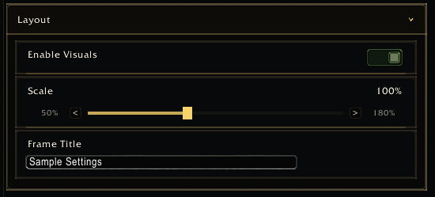

<a name="Top"></a>
<details open><summary><strong>Contents</strong></summary><br />

- [Overview](#overview)
- [Preview](#preview)
- [Fields](#fields)
- [Example](#example)
- [Formatting](#formatting)

</details>

## [Overview][Top]

A slider stores a numeric value in a bounded range.

## [Preview][Top]



## [Fields][Top]

| Field | Type | Description |
| :---- | :--- | :---------- |
| `min` | number | Minimum value. |
| `max` | number | Maximum value. |
| `step` | number | Increment size. |
| `formatter` | function | Display formatter. |
| `suffix` | string | Suffix for display text. |
| `valueFormatter` | function | Alternate value formatter. |

## [Example][Top]

```lua
app:RegisterControl("interface.bars", {
  id = "barScale",
  key = "barScale",
  type = "slider",
  label = "Scale",
  min = 0.5,
  max = 2,
  step = 0.05,
  default = 1,
})
```

## [Formatting][Top]

```lua
formatter = function(value)
  return string.format("%.0f%%", (tonumber(value) or 1) * 100)
end
```

[//]: # (Links)
[Top]: #Top
