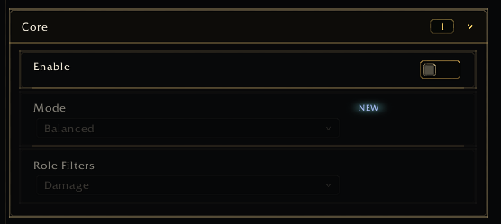

<a name="Top"></a>
<details open><summary><strong>Contents</strong></summary><br />

- [Overview](#overview)
- [Preview](#preview)
- [Fields](#fields)
- [Simple DB Toggle](#simple-db-toggle)
- [Explicit Getter and Setter](#explicit-getter-and-setter)
- [Row Actions](#row-actions)
- [Common Mistakes](#common-mistakes)

</details>

## [Overview][Top]

A toggle stores a boolean value. Use `type = "toggle"` or `type = "checkbox"`.

## [Preview][Top]



## [Fields][Top]

| Field | Type | Description |
| :---- | :--- | :---------- |
| `id` | string | Stable control id. |
| `key` | string | DB key for direct persistence. |
| `label` | string | Row label. |
| `description` | string | Short explanation. |
| `default` | boolean/function | Default value. |
| `getValue` | function | Explicit value reader. |
| `setValue` | function | Explicit value writer. |
| `isEnabled` | function | Disabled-state gate. |
| `parentCheck` | function | Parent enabled-state gate. |
| `actions` / `settingActions` | table/function | Optional small row action buttons or menus. |
| `getColor` | function | Adds an inline color picker after the toggle. |
| `setColor` | function | Writes the inline picker color. The picker is disabled while the toggle is off. |

Legacy aliases such as `var`, `text`, `desc`, `get`, and `set` are only safe
through wrapper/legacy mapping. New direct registrations should use canonical
fields.

## [Simple DB Toggle][Top]

```lua
app:RegisterControl("general.core", {
  id = "enabled",
  key = "enabled",
  type = "toggle",
  label = ENABLE or "Enable",
  description = "Enable this feature.",
  default = true,
})
```

## [Explicit Getter and Setter][Top]

```lua
app:RegisterControl("general.core", {
  id = "privateMode",
  type = "toggle",
  label = "Private mode",
  default = false,
  getValue = function()
    return MyAddonPrivateDB.privateMode == true
  end,
  setValue = function(value)
    MyAddonPrivateDB.privateMode = value == true
    MyAddon.RefreshPrivateMode()
  end,
})
```

When a toggle also provides `getColor` and `setColor`, the row renders the
toggle first and the color picker after it. The picker remains visible but is
disabled and dimmed while the toggle value is `false`.

Every control hover panel uses the complete control label as its gold heading;
there is no separate generic Notes heading. Explicit notes and compact-density
descriptions continue below it. A truncated row label creates this hover panel
even when the control has no other note or description, while a fully visible
label does not create a panel on its own.

## [Row Actions][Top]

Use `actions` for a small gear/menu next to the row. The host addon owns the
callback behavior:

```lua
actions = {
  {
    id = "privateModeTools",
    icon = "Interface\\Icons\\INV_Misc_Gear_01",
    menu = {
      { text = "Open advanced rules", onClick = function() MyAddon.OpenRules() end },
    },
  },
}
```

## [Common Mistakes][Top]

- Do not store string values like `"true"` or `"false"`.
- Do not rebuild the settings frame from the setter.
- Use explicit getters/setters for nested DB values.

[//]: # (Links)
[Top]: #Top
