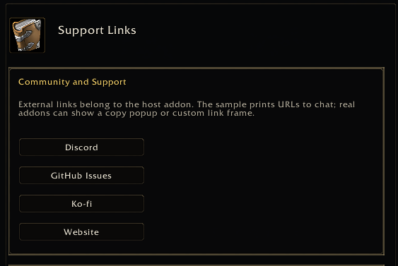

<a name="Top"></a>
<details open><summary><strong>Contents</strong></summary><br />

- [Overview](#overview)
- [Preview](#preview)
- [Recommended Pattern](#recommended-pattern)
- [Example](#example)
- [Notes](#notes)

</details>

## [Overview][Top]

Support links such as Discord, GitHub issues, Ko-fi, websites, and bug report
forms should live in host-addon metadata, not in the generic library runtime.

Use an info page for the links, then expose that page from a dashboard card,
slash command, minimap button, or existing addon UI.

## [Preview][Top]



## [Recommended Pattern][Top]

- Register a `layout = "info"` page for support/community links.
- Add `button` entries for quick actions.
- Add visible `text` entries with the raw URLs so users can copy them.
- Let the host addon decide what the button does.

World of Warcraft addons should not assume that they can open a browser
directly. Common host-addon behavior is to show a copy popup, print the URL to
chat, or open a custom frame with copyable edit boxes.

## [Example][Top]

```lua
local function ShowSupportURL(label, url)
  -- Host-owned behavior. Replace this with a copy popup or custom link frame.
  print(("MyAddon %s: %s"):format(label or "Link", url or ""))
end

local app = Config:RegisterAddOn(addonName, {
  title = "My Addon",
  dashboardTitle = "Dashboard",
  dashboard = {
    cards = {
      {
        title = "Support Links",
        description = "Discord, GitHub issues, sponsors, and website.",
        iconKey = "help",
        pageID = "help.support",
      },
    },
  },
})

app:RegisterCategory({
  id = "help",
  title = HELP_LABEL or "Help",
  order = 900,
})

app:RegisterPage({
  id = "help.support",
  category = "help",
  title = "Support Links",
  description = "Community, issue tracker, and sponsor links.",
  layout = "info",
  order = 100,
  content = {
    {
      title = "Community and Support",
      entries = {
        {
          type = "text",
          text = "Use these links for support, bug reports, or sponsoring.",
        },
        {
          type = "button",
          text = "Discord",
          width = 180,
          onClick = function()
            ShowSupportURL("Discord", "https://discord.gg/example")
          end,
        },
        {
          type = "button",
          text = "GitHub Issues",
          width = 180,
          onClick = function()
            ShowSupportURL("GitHub Issues", "https://github.com/example/MyAddon/issues")
          end,
        },
        {
          type = "button",
          text = "Ko-fi",
          width = 180,
          onClick = function()
            ShowSupportURL("Ko-fi", "https://ko-fi.com/example")
          end,
        },
      },
    },
    {
      title = "Copy Links",
      entries = {
        { type = "text", text = "Discord: https://discord.gg/example" },
        { type = "text", text = "GitHub Issues: https://github.com/example/MyAddon/issues" },
        { type = "text", text = "Ko-fi: https://ko-fi.com/example" },
      },
    },
  },
})
```

## [Notes][Top]

- Do not put addon-specific Discord, GitHub, Ko-fi, or website URLs into
  LibSettingsDesigner runtime files.
- Do not make the generic library responsible for browser integration.
- Keep button labels localized by the host addon when shipping translated
  settings pages.
- Use stable page ids such as `help.support` so dashboard cards, slash commands,
  and open-target calls remain valid.

[//]: # (Links)
[Top]: #Top
